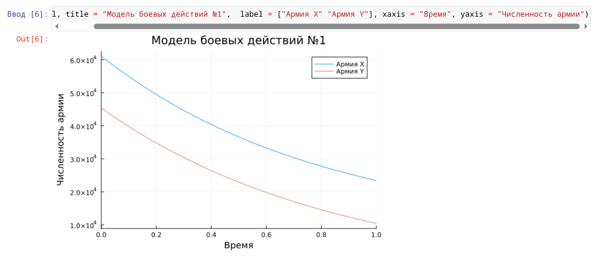
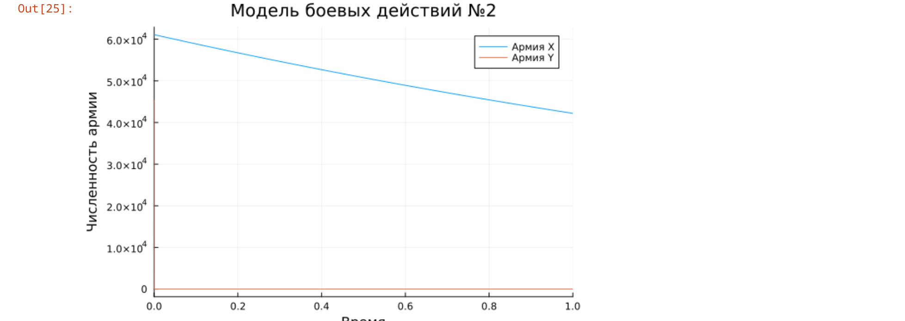
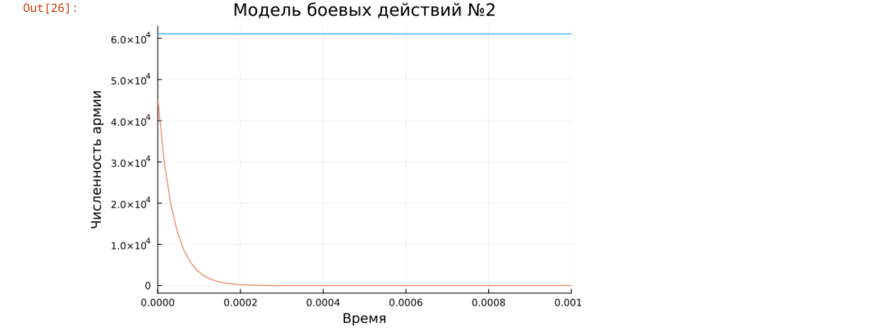

---
## Front matter
lang: ru-RU
title: Лабораторная работа №3
subtitle: Модель боевых действий
author:
  - Бекауов А. Т.
institute:
  - Российский университет дружбы народов, Москва, Россия
## i18n babel
babel-lang: russian
babel-otherlangs: english

## Formatting pdf
toc: false
toc-title: Содержание
slide_level: 2
aspectratio: 169
section-titles: true
theme: metropolis
header-includes:
 - \metroset{progressbar=frametitle,sectionpage=progressbar,numbering=fraction}
 - '\makeatletter'
 - '\beamer@ignorenonframefalse'
 - '\makeatother'
 - \usepackage{fontspec}
 - \setsansfont{DejaVu Sans}
 - \setmainfont{DejaVu Serif}
 - \setmonofont{DejaVu Sans Mono}
---

# Информация

## Цель работы

Построить модель боевых действий на языке прогаммирования Julia.

## Задание

Построить графики изменения численности войск армии $X$ и армии $Y$ для  следующих случаев:

1. Модель боевых действий между регулярными войсками

2. Модель ведение боевых действий с участием регулярных войск и партизанских отрядов

# Выполнение лабораторной работы

## Модель боевых действий между регулярными войсками

$$\begin{cases}
    \dfrac{dx}{dt} = -0.41x(t)- 0.89y(t)+sin(t+7)+1\\
    \dfrac{dy}{dt} = -0.52x(t)- 0.61y(t)+cos(t+6)+1
\end{cases}$$

## Модель боевых действий между регулярными войсками

```Julia
function reg(u, p, t)
    x, y = u
    a, b, c, h = p
    dx = -a*x - b*y+sin(t+7)+1
    dy = -c*x -h*y+cos(t+6)+1
    return [dx, dy]
end
```
## Модель боевых действий между регулярными войсками

```Julia
# начальные условия
u0 = [61100, 45400]
p = [0.41, 0.89, 0.52, 0.61]
tspan = (0,2)
```

## Модель боевых действий между регулярными войсками

```Julia
prob = ODEProblem(reg, u0, tspan, p)
sol = solve(prob, Tsit5())
plot(sol)
```

## Модель боевых действий между регулярными войсками

{#fig:001 width=70%}


## Модель ведение боевых действий с участием регулярных войск и партизанских отрядов

$$\begin{cases}
    \dfrac{dx}{dt} = -0.37x(t)-0.675y(t)+|2sin(t)|\\
    \dfrac{dy}{dt} = -0.432x(t)y(t)-0.42y(t)+cos(t)+2
\end{cases}$$


## Модель ведение боевых действий с участием регулярных войск и партизанских отрядов

```Julia
function reg_part(u, p, t)
    x, y = u
    a, b, c, h = p
    dx = -a*x - b*y+abs(2 * sin(t))
    dy = -c*x*y -h*y+cos(t) + 2
    return [dx, dy]
end
```

## Модель ведение боевых действий с участием регулярных войск и партизанских отрядов

```Julia
u0 = [61100, 45400]
p = [0.37, 0.675, 0.432, 0.42]
tspan = (0,2)\
```

## Модель ведение боевых действий с участием регулярных войск и партизанских отрядов

```Julia
prob2 = ODEProblem(reg_part, u0, tspan, p)
sol2 = solve(prob2, Tsit5())
plot(sol2)
```

## Модель ведение боевых действий с участием регулярных войск и партизанских отрядов

{#fig:003 width=70%}

## Модель ведение боевых действий с участием регулярных войск и партизанских отрядов

{#fig:004 width=70%}

## Выводы

В процессе выполнения данной лабораторной работы я построил модель боевых действий на языке прогаммирования Julia.

