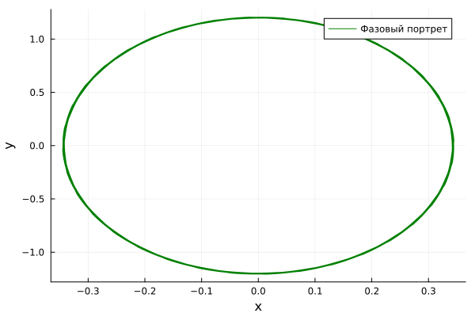
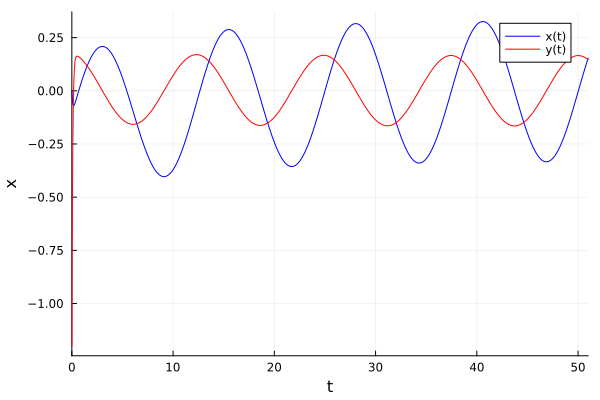

---
## Front matter
lang: ru-RU
title: Лабораторная работа №4
subtitle: Модель боевых действий
author:
  - Бекауов А. Т.
institute:
  - Российский университет дружбы народов, Москва, Россия
## i18n babel
babel-lang: russian
babel-otherlangs: english

## Formatting pdf
toc: false
toc-title: Содержание
slide_level: 2
aspectratio: 169
section-titles: true
theme: metropolis
header-includes:
 - \metroset{progressbar=frametitle,sectionpage=progressbar,numbering=fraction}
 - '\makeatletter'
 - '\beamer@ignorenonframefalse'
 - '\makeatother'
 - \usepackage{fontspec}
 - \setsansfont{DejaVu Sans}
 - \setmainfont{DejaVu Serif}
 - \setmonofont{DejaVu Sans Mono}
---

# Информация

## Цель работы

Построить математическую модель гармонического осциллятора.

## Задание

Построить фазовый портрет гармонического осциллятора и решение уравнения
гармонического осциллятора для следующих случаев:

1. Колебания гармонического осциллятора без затуханий и без действий внешней силы $$\ddot{x} + 3.5x = 0,$$

2. Колебания гармонического осциллятора c затуханием и без действий внешней силы $$\ddot{x} + 11 \dot{x} + 11 x = 0,$$

3. Колебания гармонического осциллятора c затуханием и под действием внешней силы $$\ddot{x} + 12 \dot{x} + x = 2 cos(0.5t).$$
На интервале $t \in [0; 51]$ (шаг 0.05) с начальными условиями $x_0 = 0, \,\, y_0=-1.2.$

# Выполнение лабораторной работы

## Модель колебаний гармонического осциллятора без затуханий и без действий внешней силы

```Julia

# Используемые библиотеки
using DifferentialEquations, Plots;

# Начальные условия
tspan = (0,51)
u0 = [0, -1.2]
p1 = [0, 3.5]
```

## Модель колебаний гармонического осциллятора без затуханий и без действий внешней силы

```Julia
# Задание функции
function f1(u, p, t)
    x, y = u
    g, w = p
    dx = y
    dy = -g .*y - w^2 .*x
    return [dx, dy]
end

# Постановка проблемы и ее решение
problem1 = ODEProblem(f1, u0, tspan, p1)
sol1 = solve(problem1, Tsit5(), saveat = 0.05)
```

## Модель колебаний гармонического осциллятора без затуханий и без действий внешней силы

{#fig:001 width=65%}

## Модель колебаний гармонического осциллятора без затуханий и без действий внешней силы

{#fig:002 width=65%}


## Модель колебаний гармонического осциллятора c затуханием и без действий внешней силы 

```Julia

# Используемые библиотеки
using DifferentialEquations, Plots;

# Начальные условия
tspan = (0,51)
u0 = [0, -1.2]
p2 = [11, 11]
```

## Модель колебаний гармонического осциллятора c затуханием и без действий внешней силы 

```Julia
# Задание функции
function f1(u, p, t)
    x, y = u
    g, w = p
    dx = y
    dy = -g .*y - w^2 .*x
    return [dx, dy]
end

# Постановка проблемы и ее решение
problem2 = ODEProblem(f1, u0, tspan, p2)
sol2 = solve(problem2, Tsit5(), saveat = 0.05)
```

## Модель колебаний гармонического осциллятора c затуханием и без действий внешней силы 

{#fig:005 width=65%}


## Модель колебаний гармонического осциллятора c затуханием и без действий внешней силы 

{#fig:006 width=65%}


## Модель колебаний гармонического осциллятора c затуханием и под действием внешней силы

```Julia

# Используемые библиотеки
using DifferentialEquations, Plots;

# Начальные условия
tspan = (0,51)
u0 = [0, -1.2]
p3 = [12, 1]

# Функция, описывающая внешние силы, действующие на осциллятор
f(t) = 2*cos(0.5*t)
```

## Модель колебаний гармонического осциллятора c затуханием и под действием внешней силы

```Julia
function f2(u, p, t)
    x, y = u
    g, w = p
    dx = y
    dy = -g .*y - w^2 .*x .+f(t)
    return [dx, dy]
end

# Постановка проблемы и ее решение
problem3 = ODEProblem(f2, u0, tspan, p3)
sol3 = solve(problem3, Tsit5(), saveat = 0.05)
```

## Модель колебаний гармонического осциллятора c затуханием и под действием внешней силы

{#fig:009 width=65%}

## Модель колебаний гармонического осциллятора c затуханием и под действием внешней силы

{#fig:010 width=65%}


## Выводы

В процессе выполнения данной лабораторной работы я построил математическую модель гармонического осциллятора.

